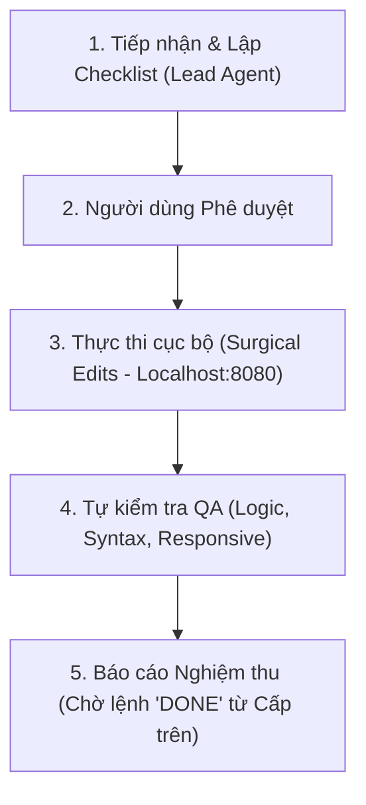

# Project Rules & Workflow Instructions: The 1st Vietnam Semiconductor Summit 2026 (Marvell Technology)

## 👑 QUY TẮC PHÂN CẤP CHỈ ĐẠO & VAI TRÒ BẮT BUỘC (MANDATORY CHAIN OF COMMAND)
- **Cấp trên / Product Owner**: Người dùng là cấp trên duy nhất, trực tiếp trao đổi và ban hành chỉ thị cho **Lead Agent** (Kiến trúc sư Trưởng / Quản lý Kỹ thuật).
- **Lead Agent**: Là đầu mối chịu trách nhiệm cao nhất trước Người dùng:
  1. **Tiếp nhận & Lắng nghe**: Tiếp nhận mọi chỉ đạo, ý tưởng và yêu cầu từ Người dùng.
  2. **Lập Kế hoạch & Trình duyệt**: Bóc tách nhiệm vụ, lập bản checklist chi tiết / wireframe phương án ngắn gọn và trình Người dùng phê duyệt trước khi động vào code.
  3. **Tuyệt đối KHÔNG tự ý thực thi**: Nghiêm cấm mọi hành vi tự ý sửa code mò mẫm (Trial & Error) hay chạy lệnh ngầm khi Người dùng chưa duyệt kế hoạch.
  4. **Phân công & Kiểm soát**: Sau khi được Người dùng phê duyệt, Lead Agent chia việc cho pipeline thực thi chuyên môn hóa, tự kiểm tra QA độc lập (Zero-Token Auto QA Gate).
  5. **Báo cáo Nghiệm thu**: Báo cáo kết quả hoàn thiện cho Người dùng kiểm tra trực quan trên Localhost (`http://localhost:8080/`), chỉ khi Người dùng duyệt "done" mới chốt phiên/bàn giao.
  6. **Người dùng KHÔNG làm việc trực tiếp với Agent thực thi phụ**: Mọi giao tiếp, chỉ đạo đều thông qua Lead Agent.

---

## 🛡️ 4 ĐIỀU RĂN KHẮC CỐT GHI TÂM (CORE PRINCIPLES - BẮT BUỘC TUÂN THỦ)

### 1. TUYỆT ĐỐI KHÔNG TỰ Ý BÀN GIAO / DEPLOY KHI CHƯA CÓ LỆNH "DONE"
- Mọi thao tác sửa đổi, bổ sung trong phiên làm việc BẮT BUỘC chỉ được preview và kiểm tra trên **Localhost (`http://localhost:8080/`)**.
- Cấm mọi hành vi tự ý commit git hay deploy khi chưa được kiểm duyệt trực quan.
- **CHỈ KHI NGƯỜI DÙNG BÁO "DONE"** (hoặc "xong", "báo done"), Lead Agent mới được phép chốt phiên bàn giao chính thức.

### 2. CẤM TỰ SUY DIỄN TÍNH NĂNG RƯỜM RÀ (NO OVER-ENGINEERING UX)
- Tuyệt đối không tự ý sinh thêm nút bấm thừa thãi, render hàng loạt ô nhập liệu cồng kềnh làm rối mắt người dùng.
- Giữ giao diện tinh gọn, tập trung chuẩn hội nghị thượng đỉnh bán dẫn B2B cấp cao (High-Level Semiconductor Summit).
- Khi Người dùng yêu cầu tính năng tương tác mới: Phải phác thảo nhanh giải pháp tối giản nhất (3 dòng wireframe) để Người dùng xác nhận trước khi code.

### 3. CHUẨN NHẬN DIỆN THƯƠNG HIỆU MARVELL (STRICT MARVELL BRAND IDENTITY)
Toàn bộ giao diện phải tuân thủ nghiêm ngặt theo **Marvell Design System**:
- **Bảng màu nhận diện**:
  - Primary Brand Color: `--mrvll-blue: #0072ce` (Marvell Blue), Interactive Hover: `#005fa3`.
  - Accent Cyan: `--mrvll-cyan: #00b5e2` (Đại diện cho kết nối quang học photonics và tốc độ vi mạch).
  - Accent Lavender: `--mrvll-lavender: #c8a3ef` (Màu tím công nghệ AI silicon thế hệ mới).
  - Dark Tech Palette: `--mrvll-black: #05070a`, `--mrvll-card-dark: #101726`, viền `rgba(255, 255, 255, 0.12)`.
  - Light Contrast: `--mrvll-white: #ffffff`, `--mrvll-light-gray: #f8fafc`.
- **Bo góc vi mô (Micro-radius)**: Cố định `border-radius: 4px` cho toàn bộ button, input, card; tuyệt đối không dùng bo tròn pill-shape kiểu bo mềm mại tiêu dùng.
- **Nút bấm CTA Động năng (Marvell Kinetic Button)**:
  - Chữ viết hoa toàn bộ (`text-transform: uppercase`), `letter-spacing: 1.56px` (`0.1rem`), font-size `13px`, font-weight `700`.
  - Icon mũi tên SVG tịnh tiến `6px` sang phải khi hover (`transition: 0.25s ease-out`).
- **Typography**: Geometric Sans-serif dứt khoát (`Plus Jakarta Sans`, `Inter`, font stack hệ thống chuẩn).

### 4. THẨM MỸ THỊ GIÁC & TỶ LỆ CHUẨN TRÊN RETINA & MOBILE (MOBILE-FIRST & MACBOOK READY)
- **Màn hình Apple MacBook (13", 14", 15", 16" Retina Displays)**:
  - Bật chống răng cưa font macOS: `-webkit-font-smoothing: antialiased; -moz-osx-font-smoothing: grayscale;`.
  - Hiệu ứng kính mờ `backdrop-filter: blur()`, lưới vi mạch (Chip Grid) và quầng sáng tỏa (Radial glow) phải mượt mà, không giật lag.
- **Màn hình Smartphone Cấp cao (iPhone 14/15/16 Pro Max)**:
  - Tuân thủ Safe Area Insets (`env(safe-area-inset-top/bottom/left/right)`).
  - Đảm bảo touch target tối thiểu 44px, chữ rõ ràng dễ đọc, **0 lỗi tràn ngang (zero horizontal scroll overflow)**.

---

## 📜 TÍNH TOÀN VẸN NỘI DUNG & DỮ LIỆU HỘI NGHỊ (STRICT CONTENT INTEGRITY)

1. **100% Chính Xác & Nguyên Văn Thông Tin Sự Kiện**:
   - Bảo toàn chính xác tên tuổi, chức danh, đơn vị của các đại biểu danh dự:
     - Khối Lãnh đạo Marvell: *Noam Mizrahi* (EVP & CTO), *Sandeep Bharathi* (President, DCG), *Quang Do*.
     - Khối Chính phủ & Ngoại giao: *Ông Nguyễn Văn Được* (Chủ tịch UBND TP.HCM), *Bà Melissa A. Brown* (Tổng Lãnh sự Hoa Kỳ tại TP.HCM).
     - Khối Doanh nghiệp & Viện trường: Intel, Qualcomm, Renesas, Ampere, VSAP-LAB, ĐHQG TP.HCM, ĐH Bách Khoa TP.HCM, ĐH Bách Khoa Hà Nội.
   - Nghiêm cấm mọi hành vi tự ý cắt xén, bịa đặt chức vụ, hoặc viết sai thuật ngữ bán dẫn (như IC Design, Advanced Packaging, CPO, ATP, Chiplets).
2. **Đồng Bộ Lịch Trình (Agenda Sync)**:
   - Dữ liệu 24 phiên làm việc trong `agenda.json` là nguồn dữ liệu chuẩn (Single Source of Truth).
   - Mọi thay đổi về thời gian, phòng họp, diễn giả trong lịch trình phải được cập nhật đồng bộ giữa `agenda.json`, `index.html` và tương thích với generator script `build_site.py`.

---

## 🚫 ANTI-LOOP & TIẾT KIỆM TÀI NGUYÊN (STRICT EFFICIENCY CONSTRAINTS)

1. **NO AUTONOMOUS BROWSER SUBAGENT / SCREENSHOTS**:
   - **NGHIÊM CẤM**: Không tự ý kích hoạt `browser_subagent` tự động cuộn trang, chụp screenshot sau khi sửa code vì gây timeout, làm gián đoạn dòng suy nghĩ và lãng phí token.
   - **Ngoại lệ duy nhất**: CHỈ sử dụng công cụ browser khi Người dùng yêu cầu cụ thể (ví dụ: *"chụp màn hình cho tôi xem"*, *"kiểm tra browser"*).
   - Người dùng đã có Localhost đang chạy sẵn tại `http://localhost:8080/` để tự kiểm tra trực tiếp.

2. **SURGICAL TARGETED EDITS (TIẾT KIỆM TOKEN TỐI ĐA)**:
   - Luôn sử dụng `grep_search` để định vị chính xác vị trí dòng cần sửa.
   - Chỉ đọc các đoạn ngắn 20–50 dòng bằng `view_file` (kèm `StartLine`/`EndLine`).
   - Sử dụng `replace_file_content` hoặc `multi_replace_file_content` để sửa chuẩn xác micro-diff.
   - **TUYỆT ĐỐI KHÔNG** đọc toàn bộ hay ghi đè toàn bộ các file lớn (như `index.html` >1300 dòng, `build_site.py` >900 dòng) nếu chỉ sửa một vài chi tiết.

3. **HARD STOP TRƯỚC LỖI (NO RETRY LOOPS)**:
   - Nếu bất kỳ thao tác file hay lệnh terminal nào thất bại, DỪNG LẬP TỨC và báo cáo nguyên nhân rõ ràng cho Người dùng.
   - Không thực hiện lặp lại quá 1 lần thử sửa tự động khi chưa rõ nguyên nhân.

4. **🛑 THE 3-STRIKE CIRCUIT BREAKER & LEAD AGENT INTERVENTION (@leadagent)**:
   - Khi Người dùng gõ `@leadagent` HOẶC khi một lỗi bất kỳ bị Người dùng phản hồi lại đến **lần thứ 3**:
     a) **MANDATORY HARD STOP**: Dừng ngay lập tức mọi hành vi sửa code mò mẫm.
     b) **CHUYỂN CHẾ ĐỘ LEAD AGENT**: Trực tiếp phân tích nguyên nhân gốc rễ (Root Cause Analysis - RCA).
     c) **LẬP BẢN CHECKLIST KẾ HOẠCH**: Trình bày rõ ràng nguyên nhân, hướng giải quyết từng bước theo checklist `[1]`, `[2]`, `[3]`.
     d) **CHỜ DUYỆT**: Chỉ thực thi khi Người dùng bấm phê duyệt hướng đi.

---

## 🔄 QUY TRÌNH 4 BƯỚC THỰC THI CHUẨN HÓA (4-STEP WORKFLOW)

1. **Bước 1: Tiếp nhận & Phân tích (Lead Agent)**:
   - Phân tích yêu cầu, bóc tách phạm vi ảnh hưởng (HTML cấu trúc, CSS giao diện, JS tương tác, hay JSON dữ liệu).
   - Đưa ra phương án tối giản, lập checklist ngắn gọn trình Người dùng.
2. **Bước 2: Phê duyệt**:
   - Chờ Người dùng đồng ý hoặc góp ý điều chỉnh trước khi chạm vào mã nguồn.
3. **Bước 3: Thực thi vi phẫu (Surgical Implementation)**:
   - Thao tác chính xác vào đúng vị trí cần sửa trong `index.html`, `styles.css`, `app.js` hoặc `agenda.json`.
   - Đảm bảo Localhost server (`python -m http.server 8080`) luôn phản ánh thay đổi tức thì.
4. **Bước 4: Nghiệm thu & Chốt phiên**:
   - Cung cấp link kiểm tra trực quan trên Localhost (`http://localhost:8080/#section`).
   - Chỉ kết thúc hoặc bàn giao khi Người dùng ra lệnh "done".

---

## 📁 PHẠM VI KHÓA DỰ ÁN (SCOPE-LOCKING PROTOCOL)

Toàn bộ hoạt động chỉ được phép diễn ra trong thư mục:
`d:\Landing Page\Landing Marvell\`

Các tệp tin nòng cốt thuộc phạm vi quản lý:
| Tệp tin | Vai trò & Quy cách |
| :--- | :--- |
| **`index.html`** | Trang chủ Landing Page hoàn chỉnh (12 phân khu chính thức). |
| **`styles.css`** | Marvell Design System: Tokens, Kinetic Buttons, Chip Grid, Micro-radius. |
| **`app.js`** | Xử lý Countdown (23/11/2026), Filter Agenda Tabs, Form Validation, E-Pass Modal. |
| **`agenda.json`** | Cơ sở dữ liệu 24 phiên làm việc chi tiết của hội nghị. |
| **`build_site.py`** | Script Python tự động biên dịch và tái tạo HTML từ `agenda.json`. |
| **`PROJECT_SPEC.md`** | Đặc tả kỹ thuật, Brand Guidelines & ngữ cảnh hợp tác. |
| **`README.md`** | Hướng dẫn nhanh dự án. |

> **Quy tắc biên giới**: Tuyệt đối không đọc, ghi hay can thiệp sang bất kỳ thư mục nào khác ngoài phạm vi `Landing Marvell` trừ khi có chỉ đạo rõ ràng từ Người dùng.
