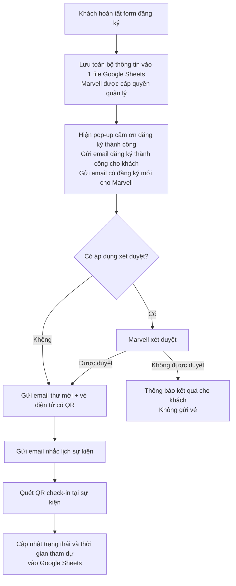

# WORKFLOW ĐĂNG KÝ THAM DỰ SỰ KIỆN MARVELL

**The 1st Vietnam Semiconductor Summit 2026**  
**Bản rút gọn gửi khách hàng review | Phiên bản 1.1 | 28/09/2026**

Sự kiện miễn phí 100%, không có bước thanh toán. Quy trình đề xuất gồm đăng ký, gửi thông báo, phát hành thư mời và vé điện tử, nhắc lịch và check-in.

**Quản lý danh sách đăng ký:** Toàn bộ thông tin khách đăng ký được tự động lưu tập trung vào **một file Google Sheets**. Marvell được cấp quyền truy cập để quản lý, theo dõi và xuất danh sách. File này đồng thời ghi nhận trạng thái xét duyệt (nếu áp dụng), tình trạng gửi thư mời và kết quả check-in.

**Ngay khi đăng ký thành công**

Sau khi thông tin được lưu thành công vào Google Sheets, hệ thống hiển thị pop-up cảm ơn và thực hiện hai thông báo email:

- **Gửi khách:** Xác nhận đăng ký thành công, tóm tắt thông tin đăng ký và hướng dẫn theo dõi email tiếp theo.
- **Gửi Marvell:** Thông báo có đăng ký mới, thông tin người đăng ký và đường dẫn Google Sheets để theo dõi/xét duyệt. Email nội bộ chỉ gửi đến đầu mối Marvell được chỉ định.

Nội dung pop-up đề xuất: **“Cảm ơn bạn đã đăng ký thành công! Vui lòng kiểm tra email để theo dõi thông tin tham dự sự kiện.”**

**Bước xét duyệt: Marvell lựa chọn một trong hai phương án**

- **Có xét duyệt:** Phù hợp khi cần kiểm soát đối tượng khách mời hoặc số lượng chỗ. Email đăng ký thông báo hồ sơ đang chờ xét duyệt; chỉ khách được duyệt mới nhận thư mời và vé điện tử.
- **Không xét duyệt:** Phù hợp khi mở đăng ký rộng rãi. Các hồ sơ hợp lệ, còn trong hạn mức tiếp nhận được chuyển sang danh sách gửi thư mời và vé điện tử.

**Thư mời và vé điện tử gửi sau**

Gửi **một email gồm cả thư mời và vé điện tử có QR**, tách với email xác nhận đăng ký ban đầu. Email được gửi theo lịch BTC thống nhất; nếu áp dụng xét duyệt, chỉ gửi sau khi hồ sơ được chấp thuận. Nội dung gồm thông tin sự kiện, vé QR và hướng dẫn check-in.

**Nhắc lịch và ghi nhận tham dự**

Đề xuất gửi email nhắc lịch trước sự kiện **24 giờ**, kèm thông tin địa điểm, thời gian và vé QR. Chỉ gửi cho khách đã được xác nhận tham dự, chưa hủy; tránh gửi nhắc lịch sát email thư mời.

Tại sự kiện, nhân sự quét QR để check-in; hệ thống cập nhật trạng thái **Đã tham dự** và thời gian check-in vào Google Sheets. Vé đã check-in sẽ có cảnh báo khi quét lại.

**Các điểm vận hành cần thống nhất**

1. Có hoặc không áp dụng xét duyệt; hạn mức tiếp nhận đăng ký.
2. Đầu mối Marvell nhận email đăng ký mới và quản lý danh sách.
3. Lịch gửi thư mời/vé điện tử và mốc nhắc lịch.

Đăng ký trùng email không tạo thêm hồ sơ hoặc vé. Nếu lỗi lưu dữ liệu, chưa hiển thị đăng ký thành công. Nếu dữ liệu đã lưu nhưng gửi email lỗi, giữ nguyên hồ sơ và xử lý gửi lại; không yêu cầu khách đăng ký lại.
